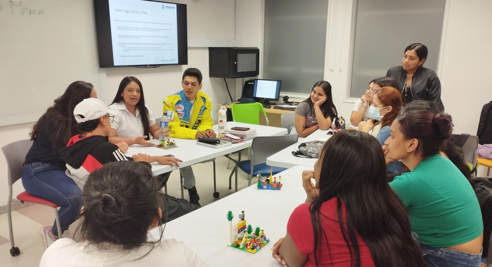

```{r setup, include=FALSE}
knitr::opts_chunk$set(echo = FALSE)
```

# The Fulbright Program

The Fulbright program was founded by United States Senator J. William Fulbright in 1946 and has been considered one of the most prestigious scholarships in the United States

The program provides approximately 8,000 grants annually, comprising roughly:

- 1,600 grants to U.S. students, 
- 1,200 to U.S. scholars, 
- 4,000 to foreign students, 
- 900 to foreign visiting scholars, and 
- several hundred to teachers and professionals.

# The Fulbright Specialist Program

Fulbright Specialist Program is open for U.S. academics and established professionals to engage in two- to six-week, project-based exchanges at host institutions.  

Each year this program supports around:

- 400 Specialist projects, 
- in 24 Eligible Disciplines
- in 160 Countries

# My Role 

UniRemington's Fulbright Specialist application 

- called for a Fulbright consultant 
- with background in Innovation & Creativity
- to develop innovative protocols for courses conducted in their Innovation & Creativity (LEGO) Lab

Otherwise there were really no constraints on my remit, and 

- I found the University open to discussing all sorts of creative activities


# The ExL of LEGO Serious Play 

LEGO workouts combine experiential learning (ExL) with  various forms of active learning such as action learning, adventure learning, free-choice learning, cooperative learning, service-learning, and situated learning.

Experiential learning is distinct from traditional "talking heads" _rote_ or _didactic_ learning where the student is a passive, and often disengaged participant

We wanted to find ways to expand on the basics explored in LEGO workouts 

- in search of scalable, asynchronous learning protocols
- that will be attractive to the connected and interactive lifestyle of today's generation

# Objectives of My Involvement

Three particular objectives were agreed on early when I reviewed activities in the Innovation & Creativity (i.e., LEGO Serious Play) Lab:

- improve __scalability__ of courses in virtual, asynchronous teaching environments
- develop __"experiential"__ protocols for existing curricula to better attract and engage students
- ultimately __help design and develop a "library"__ of experiential models for one week of material in a variety of classes in the business school, all housed in the university's Innovation & Creativity Lab 


```{r  fig.align='left', out.width="15%"}
library(knitr)


```


# Getting to Know UniRemington  (Students and the LEGO Lab)


```{r, echo=FALSE,out.width="30%", fig.show='hold',fig.align='center'}


knitr::include_graphics(c("students3.jpg","students2.jpg","students4.jpg" ))

knitr::include_graphics(c("students6.jpg","students5.jpg","students.jpg" ))


```

# Getting to Know UniRemington  (Faculty)


```{r, echo=FALSE,out.width="45%", fig.show='hold',fig.align='center'}

knitr::include_graphics(c("lab_collegues.jpg","lunch.jpg"))

```

# Brainstorming "Interactive Experience"  at the Escape Room

Escape Rooms are hugely successful games 

- inspired by the Myst computer games of the 1990s 
- they are hugely popular, commercially successful and have engaged a wide range of audiences

They engage players in a physical environment with a sequence of time constrained puzzles and an ultimate objective that varies with each game


```{r  fig.align='left', out.width="45%"}
library(knitr)
include_graphics("escape.jpg")

```


# Brainstorming "Interactive Experience"  at the Escape Room


Here were lessons we could learn about successfully engaging players in an "experience" 

- make the challenges visceral
- facilitator remote monitors and only steps in when players are "stuck"
- communication is via a computer monitor, players are on their own
- use a sequence of short workouts / puzzles (<10 minutes) to keep interest


# Classroom Engagement and Protocols

We asked "What can we do with a course to create an exciting and engaging student _'interactive experience'_?"  

In collaboration with the faculty, we decided to prototype the creation of "interactive experiences" using the Innovation & Creativity Lab supporting three different 2-hour classes:

- Marketing mix and strategy 
- Colombian Economy and flows of money 
- Portfolio management

These selections cover a diverse set of topics assuring a wide buy-in by university faculty

# Class 1:  Marketing Mix Class
\small

Objective: Learn how to achieve an optimal _Marketing Mix_  with LEGO integration:

Class Overview:

- Format: In-person, synchronous (i.e., all at the same time, same place) two-hour interactive session.
- Flow: Introduction and setup, followed by six decision-making rounds on product, price, place, and promotion in the marketing mix.
- Reflection: Post-round reflections and a final session for grading and real-world insights into market dynamics and strategic decisions.


# Class 1:  Marketing Mix Class
\small

Enhancements from Escape Room Insights:

- Facilitator’s Role: Subtle guidance to keep participants engaged and productive.
- Group Size: Ideal groups of five for balance between individual participation and teamwork.
- Task Segmentation: Short, sequential tasks for progressive learning and focus.
- Physical Space: Defined work zones to enhance focus and teamwork.


```{r  fig.align='left', out.width="30%"}
library(knitr)
include_graphics("lego.jpg")

```


# Class 1:  Marketing Mix Class
\small

Engagement Techniques:

- Instructions & Cues: Clear verbal instructions with timed visual/auditory cues for responsiveness.
- Monitoring & Feedback: Remote monitoring with digital feedback for autonomy and support.
- Timed Hints: Scheduled cues to ensure critical information is retained, boosting engagement.


Goal: Create a simulation that is interactive, effective, and fosters deep learning through hands-on engagement and teamwork.


```{r  fig.align='left', out.width="30%"}
library(knitr)
include_graphics("lego.jpg")

```


# Class 2: The Colombian Economy and Flows of Money 
\small

Class Overview:

- Format: In-person, two-hour interactive session.
- Flow: Student briefing and simulation setup, followed by six decision-making rounds where each institution (bank, government, consumers, industry) pursues its unique goals and philosophy, all of which influence their control over monetary policy and flows
- Reflection: Post-round reflections and a final session for grading and real-world insights into decisions that helped or hurt the Colombian economy, industry, and households


```{r  fig.align='left', out.width="50%"}
library(knitr)
include_graphics("economy.jpg")

```


# Class 2: Colombian Economy and Flows of Money Class
\small

Sequence of Workout Tasks for Colombian Economy and Flows of Money Class:

Introduction (10 min): Outline objectives, simulation mechanics, and setup instructions.

Challenge Rounds (6 rounds, 15 min each):

- Provide simulated currency (fake bills or LEGO pieces) to students.
- Students represent roles in the economy (government, central bank, households, industry).
- Groups of four compete based on their chosen economic philosophy.
- Event Presentation (1 min): Up to five random events are introduced, impacting each group differently based on their economic philosophy.

# Class 2: Colombian Economy and Flows of Money Class
\small

Active Play (10 min): Students adjust money flows with LEGO tokens and bills according to event impacts.

Reflection (5 min): Groups evaluate decisions and develop strategies for the next round.

Final Reflection (15 min): Group discussion on strategies, patterns observed, and learning outcomes.

Self-Grading and Evaluation: Groups assess each others' success in managing the Colombian economy.

Teacher Evaluation: The teacher grades each group on ultimate simulated GDP, per capita wealth, industrial output, and tax revenues.


# Class 3:  Portfolio Management Class Designed for Scalability
\small


__[Virtual Classroom Challenge - Instructions](https://github.com/westland/Fulbright/blob/main/portfolio_mngt_virtual_class.pdf)__

Format of Asynchronous Portfolio Management Class: Virtual, fully automated, accessible 24/7 

Structure:

- Introduction and Setup: Overview of objectives and app mechanics.
- Interactive Rounds: Six rounds where students analyze event impacts, adjust investments, and receive immediate grading.
- Reflection: Post-round reflection for strategic insights.
- Performance Incentives: Leaderboard and grading curve to motivate students.
- Final reflections and Grading


# Class 3:  Portfolio Management Class Designed for Scalability
\small

Applying Escape Room Protocols: To enhance simulation experiences, fostering engagement, teamwork, and effective learning

- Facilitator’s Role: Not necessary, but where used, subtle guidance to maintain engagement and productivity.
- Task Segmentation: Short, sequential tasks for focused learning.
- Physical Space: None needed
- Monitoring & Feedback: Remote progress tracking with digital feedback to encourage autonomy.
- Timed Hints: Cues to highlight critical information, boosting engagement and responsiveness.


# Class 3:  Portfolio Management Class Designed for Scalability
\small


__[Virtual Classroom Challenge - Software](https://jcwestland.shinyapps.io/virtual_invest_class/)__


Summary of sequence of workout tasks for the Portfolio Management class:

- Introduction (10 minutes): Overview of objectives, simulation mechanics, and setup.
- Challenge Rounds (6 rounds, 15 minutes each) and Event Presentation: Up to 5 random events impact specific securities.
- Active Play (10 minutes): Students adjust holdings using sliders based on event impacts.
- Reflection (5 minutes): Evaluate decisions, strategize for the next round..
- Automatic grading based on portfolio value, risk management, and strategic consistency.


# Investment in Colombia's Future: Experiential, Asynchronous, Automated 
\small

__Unlocks Potential of a Young, Energetic Workforce:__ Colombia’s youthful population holds enormous potential to drive economic growth, but they need access to relevant, high-quality education tailored to modern industry needs.

__Bridges the Teacher Gap in Tech-Centric Fields:__ With a shortage of educators trained in current tech and industry practices, automated, self-paced courses can scale high-demand knowledge to thousands without overwhelming the teaching workforce.

__Expands Access Amid Limited Institutional Capacity:__ Colombia’s educational institutions face capacity constraints, making it challenging to meet the training demands of emerging industries. Asynchronous courses allow students to learn on their own schedule, overcoming space and resource limitations.


# Investment in Colombia's Future: Experiential, Asynchronous, Automated 
\small

__Prepares for the Global Shift in Job Markets:__ Rapid changes in the global economy, such as automation, data-driven decision-making, and digital services, are reshaping the job landscape. These courses provide skills for the future, ensuring Colombia’s youth can compete on the international stage.


__Fuels Economic Dynamism and Export Capacity:__ A workforce skilled in tech and industry-relevant fields empowers Colombia to diversify its economy, boost exports, and elevate its presence in the global market, contributing to sustainable national growth.

# Investment in Colombia's Future: Experiential, Asynchronous, Automated 
\small

__Equips Colombia to be a Regional Leader:__ By fostering a well-prepared, tech-savvy workforce, Colombia can not only support its own economy but also become a leader in Latin America, attracting investments, talent, and innovation from around the world.

__Supports Lifelong Learning and Economic Resilience:__ With continuous access to industry-relevant knowledge, Colombians can adapt to evolving industries over their careers, creating a resilient workforce prepared to pivot as new opportunities emerge.

__Investing in these courses is more than education; it’s a strategy for long-term economic strength and global influence.__


# It wasn't all work: Discovering Colombia


```{r, echo=FALSE,out.width="15%", fig.show='hold',fig.align='center'}

knitr::include_graphics(c("boterro1.jpg","fruit.jpg","guatape.jpg" ))


knitr::include_graphics(c("medellin.jpg","dancers.jpg","trail.jpg" ))


knitr::include_graphics(c("drink.jpg","coffee4.jpg","el_pueblo.jpg" ))

knitr::include_graphics(c("randacoffee2.jpg","coffee2.jpg","arepa3.jpg" ))

```


# Reflection


```{r, echo=FALSE,out.width="45%", fig.show='hold',fig.align='center'}

knitr::include_graphics(c("universe.jpg","sitelink.png" ))
library(knitr)


```

